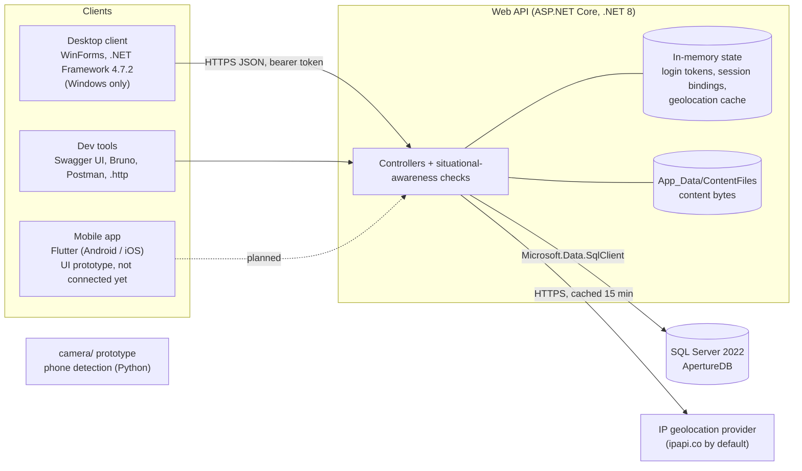
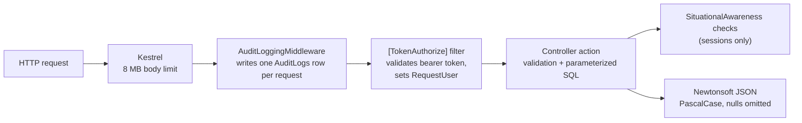
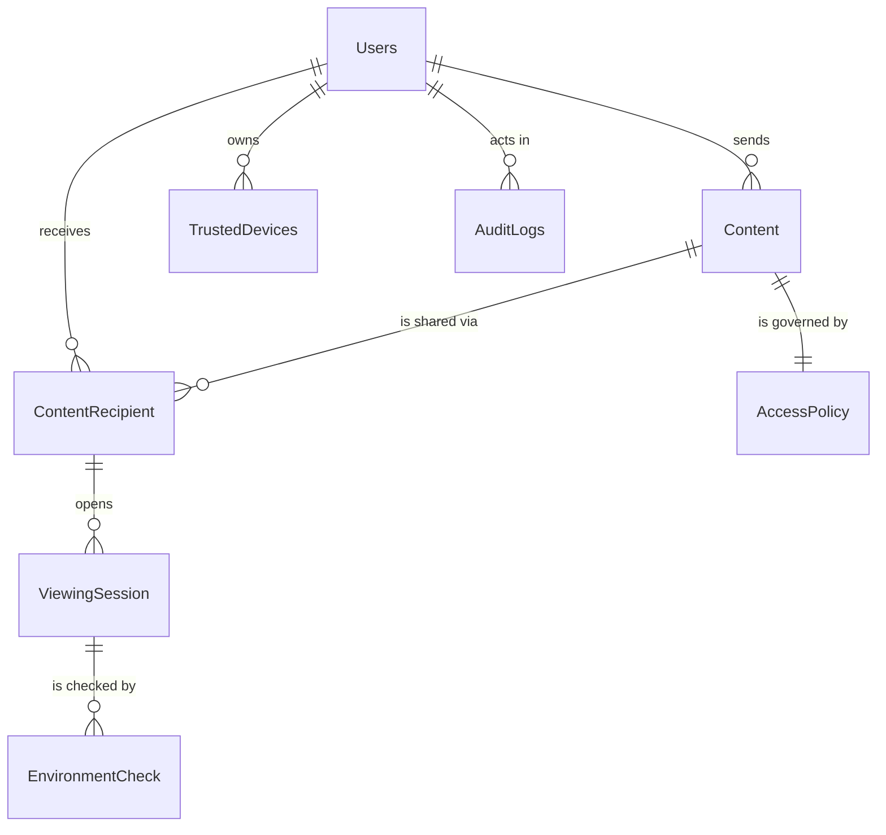
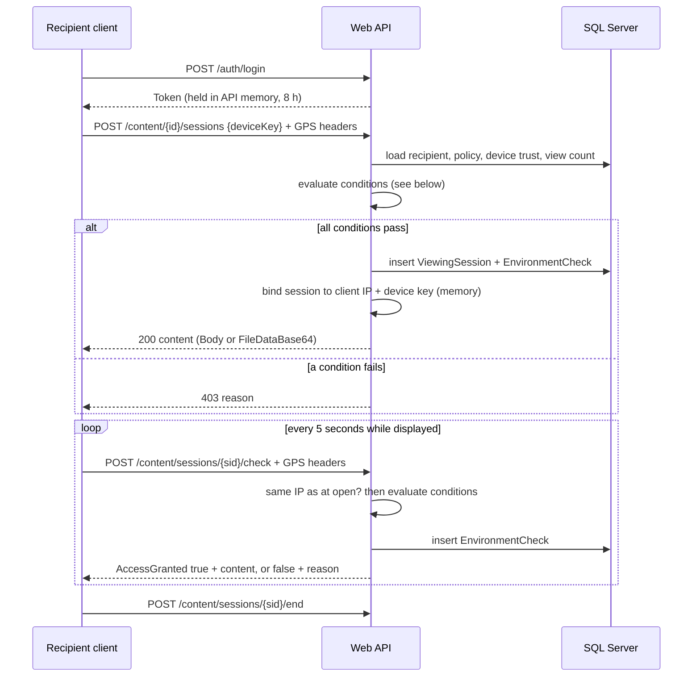

# Aperture architecture

Aperture lets a sender share content (text or an image) with one recipient under conditions the sender chooses: a time window, a view limit, an approved device, a location, and so on. The recipient views the content in an Aperture client. The server checks every condition when the content is opened, then **again every five seconds** while it stays on screen. When a condition stops being met, the server stops serving the content.

This document describes how the pieces fit together. To run things locally, see [Aperture WebAPI/README.md](../Aperture%20WebAPI/README.md).

## Components

| Component | Location | Technology | Status |
|---|---|---|---|
| Web API | [`Aperture WebAPI/`](../Aperture%20WebAPI/) | ASP.NET Core on .NET 8, Newtonsoft.Json, Microsoft.Data.SqlClient, SkiaSharp | Main backend; runs on macOS, Linux and Windows |
| Database | [`Aperture WebAPI/Aperture_Diagram_Database.sql`](../Aperture%20WebAPI/Aperture_Diagram_Database.sql) | SQL Server 2022 (Docker for local development) | Schema in use |
| Desktop client | [`Aperture Desktop Client/`](../Aperture%20Desktop%20Client/) | Windows Forms, .NET Framework 4.7.2 | Working client; Windows only |
| Mobile app | [`mobile/`](../mobile/) | Flutter | UI screens and native screen-capture protection; does not call the API yet (`api_service.dart` is empty) |
| Camera prototype | [`camera/`](../camera/) | Python, OpenCV, MediaPipe | Standalone experiment that detects a phone in the webcam feed; not integrated |
| Legacy schema | [`db/schema.sql`](../db/schema.sql) | MySQL | Early draft; **not used** by the API |

## Web API

### Request pipeline

Every request passes through the same stages, in this order:

- **Program.cs** wires everything: Newtonsoft JSON (the same wire format as the original Web API 2 version), the audit middleware, controllers, and Swagger in Development only.
- **AuditLoggingMiddleware** records the method, status and path of every request in `AuditLogs`. It never stores request or response bodies. A failure to write the audit row never fails the request.
- **TokenAuthorizeAttribute** reads `Authorization: Bearer <token>`, looks up the token, loads the user from SQL and stores it for the request (`RequestUser`). If the token is missing or unknown, it returns `401 {"success":false,"message":"Authentication required."}`.
- **Controllers** contain the business rules and talk to SQL directly through `Microsoft.Data.SqlClient` with parameterized commands. There is no ORM or repository layer apart from `AuditLogRepository`.

### Code layout

| Folder | What lives there |
|---|---|
| `Controllers/` | Auth, Register, User, Device, Content (sharing, policies, viewing sessions). `ApiControllerBase` keeps the Web API 2 error shapes (`{"Message": ...}` on 400). |
| `SituationalAwareness/` | Self-contained access conditions: `LocationCheck` (IP-based and precise GPS), `TimeWindowCheck`, `SessionSuspension` (suspend/restore state), plus `LocationPolicyController`, `TimePolicyController` and `SessionSuspensionController`. |
| `Services/` | `AuthenticationService` (login and in-memory tokens), `PasswordService` (PBKDF2), `TokenService`, `IpGeolocationService`. |
| `Infrastructure/` | Audit middleware, `RequestUser`, `BearerToken`, `CurrentHttpContext` (a stand-in for `HttpContext.Current`), Swagger operation filter. |
| `Config/` | `AppSettings` and `ConnectionStrings`, read from `appsettings*.json` and environment variables. |
| `Models/` | Request and response DTOs. |

### Endpoints

All routes are under `/api`. Every route except register and login needs a bearer token. The full, always-current reference is the OpenAPI spec at `/swagger/v1/swagger.json`, with Swagger UI at `/swagger` (both Development only).

| Area | Routes |
|---|---|
| Accounts | `POST register`, `POST auth/login`, `POST auth/logout`, `GET user/me` |
| Sharing (sender) | `GET content`, `POST content`, `POST content/{id}/policy` (pause/resume), `POST content/{id}/revoke` |
| Situational policies (sender) | `POST situational/content/{id}/location` (GPS point + radius), `POST` / `GET situational/content/{id}/time` |
| Session suspension (sender or recipient) | `POST situational/sessions/{sessionId}/suspend`, `GET situational/sessions/{sessionId}/suspension` |
| Viewing (recipient) | `POST content/{id}/sessions`, `POST content/sessions/{sessionId}/check`, `POST content/sessions/{sessionId}/end` |
| Devices | `POST devices` (registers a device as untrusted) |

## Data model

The database follows the project's ER diagram. SQL Server holds metadata only. The content bytes are stored as files in `App_Data/ContentFiles/{ContentID}.bin`, so back up that folder together with the database.

| Table | Purpose |
|---|---|
| `Users` | Accounts. `PasswordHash` holds `iterations.salt.hash` (PBKDF2-SHA256, 100,000 iterations). |
| `Content` | One row per shared item: sender, title (`FileName`), `FileType` (`text/plain`, `image/png`, `image/jpeg`). |
| `ContentRecipient` | Who the content is shared with, and their `AccessStatus` (`Active` / `Revoked`). |
| `AccessPolicy` | One per content item: `StartTime`, `ExpirationDate`, `RequiredLocation` (JSON), `TrustedDevice`, `MaximumViews` (a BIT: `1` means one view), `ScreenshotRestriction`, `PolicyStatus` (`Active` / `Paused`). |
| `TrustedDevices` | Device keys registered by users; `IsTrusted` is set by an administrator in SQL. |
| `ViewingSession` | One per open of a content item: `Active`, `Ended` or `Revoked`. |
| `EnvironmentCheck` | One row per session open and per periodic check: what was verified and the violation reason. This is the audit trail of access decisions. |
| `AuditLogs` | One row per API request. |

`RequiredLocation` holds one of two JSON shapes:

- Coarse: `{"Country":"US","Region":"FL","City":"Boca Raton"}`, checked against the IP address's geolocation.
- Precise: `{"Latitude":26.37,"Longitude":-80.10,"RadiusMeters":500}`, checked against the GPS fix the client sends.

## How access is enforced

### Viewing session lifecycle

### Conditions, in evaluation order

`ContentController.Evaluate()` stops at the first condition that fails:

1. **Revoked or paused.** `ContentRecipient.AccessStatus` and `AccessPolicy.PolicyStatus` must both be `Active`.
2. **Time window.** Access starts at `StartTime` and expires at `ExpirationDate`, both UTC.
3. **Maximum views.** With a one-view limit, only the first session may open. This is checked on open only.
4. **Approved device.** If required, the session's device key must be in `TrustedDevices` with `IsTrusted = 1`.
5. **Location.**
   - Precise policies go to `LocationCheck`: the haversine distance between the policy point and the client's `X-Client-Latitude` / `X-Client-Longitude` must be within the radius.
   - Coarse policies go to `IpGeolocationService`, which matches the client IP's country, region and city.
6. **Screenshot restriction.** The desktop client cannot enforce it, so the API denies access rather than claim it is enforced.

On every `/check`, the request must also come **from the same IP address** that opened the session. Loopback addresses count as one address. `X-Forwarded-For` is deliberately not trusted.

### Suspend or end

A session can be suspended in two ways, and `SessionSuspension` tracks both:

- **By a failed check.** A periodic check fails for a recoverable reason (the table below).
- **On purpose.** The content's sender, or the recipient viewing it, calls `POST /api/situational/sessions/{sessionId}/suspend` with an optional `Reason` and a `DurationSeconds` (1 to 3600, default 30). For example, a client that detects another person in the room can hide the content for a while.

While a suspension is in effect, checks return `AccessGranted: false`, the session stays `Active`, and each check is still recorded in `EnvironmentCheck`. A manual suspension denies every check until its hold time has passed, without evaluating the policy, and the check's message is `Session suspended: <reason>`. A suspension of either kind is lifted by **the next check that passes every condition**. `GET /api/situational/sessions/{sessionId}/suspension` returns the current state: `Suspended`, `Source` (`manual` or `check`), `Reason`, `SinceUtc`, and `HoldUntilUtc` (manual only).

When a periodic check fails, `SessionSuspension` decides what happens to the session:

| Failure | Result |
|---|---|
| Recoverable: outside the radius, missing GPS fix, IP changed, device not approved, country/region/city mismatch, a manual suspension's hold | **Suspended.** The session stays `Active` and the content is withheld for that check. The next passing check returns the content again. |
| Not recoverable: revoked, paused, not yet begun, expired, geolocation provider failure, any unrecognized reason | **Ended.** The session is marked `Revoked` and the client must open the content again. |

Unrecognized reasons end the session, so the policy fails safe.

### What the server cannot guarantee

- Content that was already displayed, screenshotted or copied cannot be taken back. The checks control continued display in Aperture clients only.
- The device key is a demo identifier stored on the client. It can be copied, and it is not hardware attestation.
- IP geolocation is approximate, and so is a client-reported GPS fix, which can be spoofed. Both are signals, not proof of location.
- The mobile app blocks capture on Android (`FLAG_SECURE`) and detects it on iOS (`UIScreen.isCaptured`). The desktop client has no capture protection.

## State and deployment constraints

| State | Where it lives | Lost when |
|---|---|---|
| Login tokens (SHA-512 hash, 8 h expiry) | `AuthenticationService`, process memory | The API restarts |
| Session → IP + device key binding | `ContentController`, process memory | The API restarts (open sessions then get "Session expired") |
| Session suspensions (source, reason, hold time) | `SessionSuspension`, process memory | The API restarts (the sessions themselves are invalidated too) |
| Geolocation results | `IpGeolocationService`, 15-minute cache | The API restarts |
| Everything else | SQL Server and `App_Data/ContentFiles` | Never (back both up together) |

The approved schema has no token or session-binding tables, which is why that state is kept in memory. As a result:

- **Run exactly one API instance.** A second instance or a load balancer would not see the first one's logins or sessions.
- **Every restart logs everyone out** and invalidates open viewing sessions.
- Behind a reverse proxy, the API would see the proxy's IP for every client. Supporting a proxy needs a deliberate trusted-proxy design.

## Configuration

| Setting | Source | Default |
|---|---|---|
| `ConnectionStrings:Database` | `appsettings.json`, `appsettings.Development.json`, or `ConnectionStrings__Database` | Development: the local Docker SQL Server (`sa`). Otherwise: Windows integrated auth to `localhost` |
| `IpGeolocationUrl` | `appsettings.json` or environment | `https://ipapi.co/{0}/json/` (free tier, development only) |
| Listen addresses | `Properties/launchSettings.json` or `ASPNETCORE_URLS` | `https://localhost:44353` (expected by the desktop client), `http://localhost:5080` |
| Environment | `ASPNETCORE_ENVIRONMENT` | `Development` for local runs; enables Swagger |

Local infrastructure is defined in [`Aperture WebAPI/docker-compose.yml`](../Aperture%20WebAPI/docker-compose.yml). It runs SQL Server 2022 bound to `127.0.0.1:1433`, plus a one-time `db-init` service that creates the schema on first start.

## Testing the API

- **Swagger UI** (`/swagger`): try any endpoint from the browser after clicking **Authorize** with a login token.
- **Bruno collection** ([`Aperture WebAPI/bruno/`](../Aperture%20WebAPI/bruno/)): the full sender-to-recipient flow, including location and time policies and session suspension. Each authenticated request logs in by itself. Run it with the `Local` environment.
- **`Aperture WebAPI.http`** (VS Code REST Client) covers the same flow.

There are no automated unit or integration tests yet.

## History

The API began as an ASP.NET Web API 2 project on .NET Framework 4.7.2, hosted in IIS Express, which only runs on Windows. It was ported to ASP.NET Core on .NET 8 so it can be developed on any OS. Routes, request and response JSON, SQL, and access rules were kept identical, so the existing desktop client works without changes.
